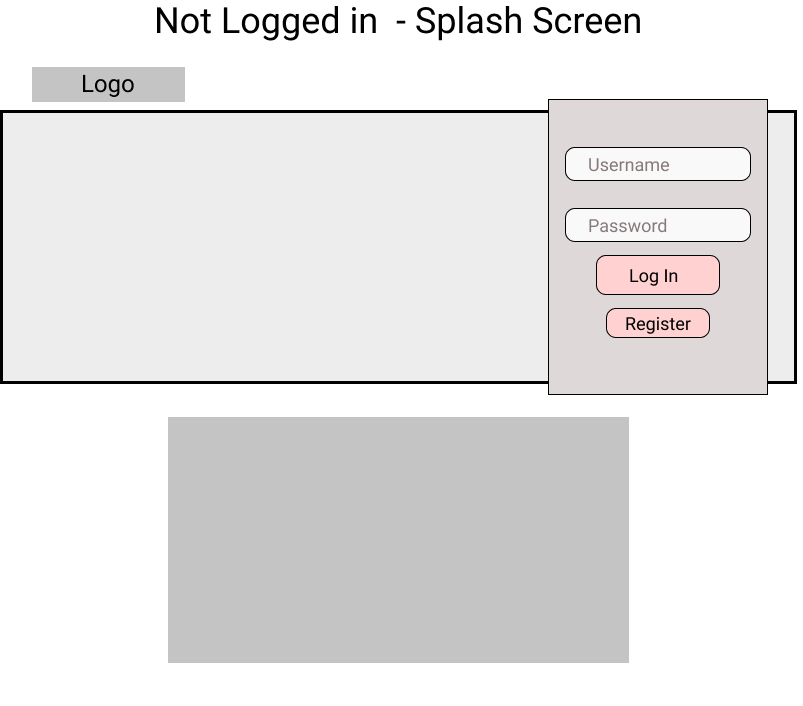
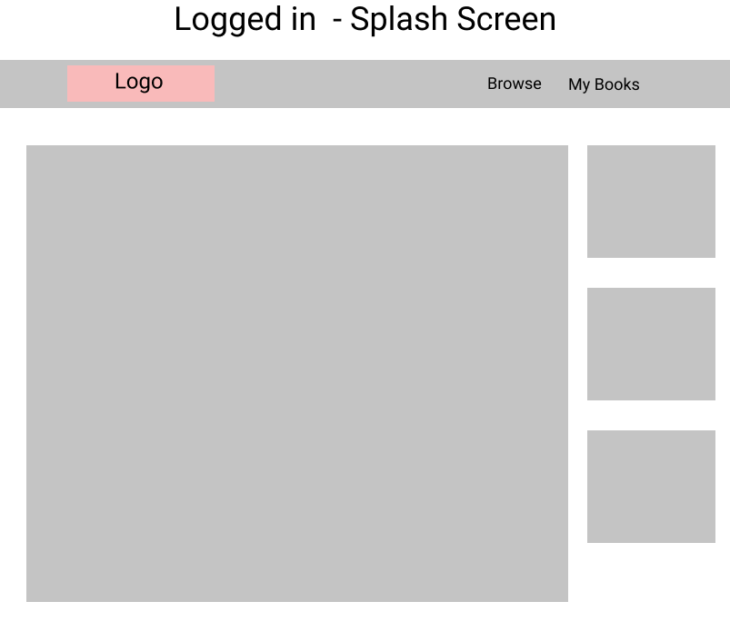
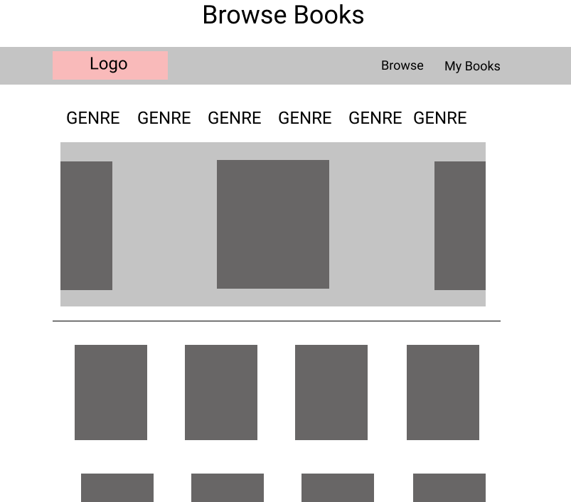
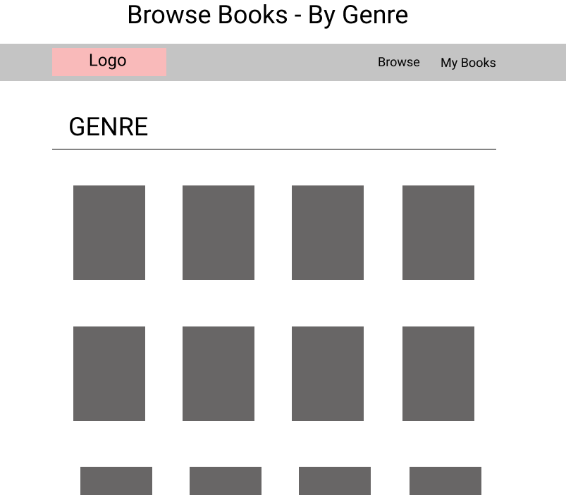
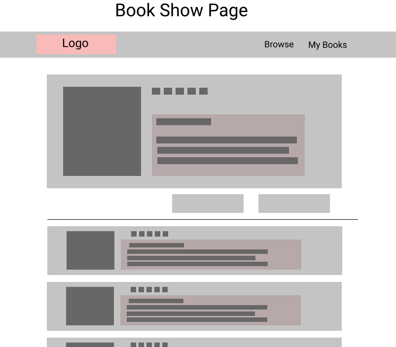
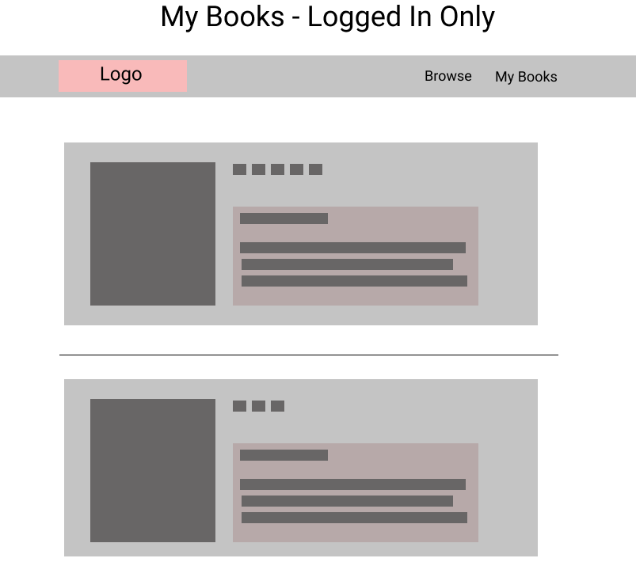

# Table of Contents

- [Description](#bestreads)
- [User Flow](#user-flow)
- [Wireframes](#Wireframes)
- [Technologies](#Technologies)
- [Collaborators](#Collaborators)

# bestreads

bestreads is a new take on social media revolving around books.

Join groups of avid readers in a judgement free, and welcoming place!

# User Flow

## Not Logged In

When the user lands on the page without being logged in, they will be welcomed with a splash page with the season's artwork as well as a section to either **Log In** or **Register**.

Under the login section there will be a section showing a selection of features books.

## After Logging In

After logging in, the user will be greeted with that month's bestread's book clubs.

On the right column, there will be a section for the user's reading goal for the year. And another section recommending a book.

On the **Navbar**, there will be a link to **Browse** as well as **My Books**.

## Browse

In the **Browse** page, the user will see a section of featured books. Below that section there will be an assortment of books for the user to browse through.

The user will also see a breakdown of genres that will be clickable for the user to filter by that genre.

All books will be clickable and redirect the user to a **Book Show Page**

## Book Show Page

In the **Book Show Page**, the user will be able to see details of the book.

Below the book details there will be a button to help the user find a location to buy the book.

Under the buy button there will be an assortment of reviews from various users.

## My Books

In the **My Books** page, the user will see a collection of every book they've read and rated.

This will serve as an archive and a record for the user to have one place to track their reading journey.

# Wireframes

# Technologies

- Node
- MongoDB
- Express
- Mongoose
- EJS

# Collaborators

- Tony Villa
- Demencio Lafleur
